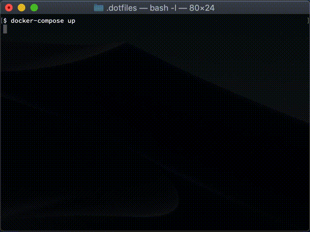

## About

This repository is the scripts and configuration files for the provision of my environment on macOS and Linux.

That includes tools and settings as below.

- `.zshrc`, and zsh plugins via [zinit](https://github.com/zdharma/zinit)
- `.tmux.conf`, and tmux plugins via [tpm](https://github.com/tmux-plugins/tpm)
- `.vimrc`, and vim plugins via [Vundle.vim](https://github.com/VundleVim/Vundle.vim)
- (for macOS) `Brewfile` for [Homebrew](https://github.com/Homebrew/brew)
- recipes like Makefile for setting up those files powered by [cargo-make](https://github.com/sagiegurari/cargo-make)

The purpose of this repository is to set up my environment for me, Although I am glad if this repository as a useful example when you provision your environment.

## How to use

1. (macOS) Sign in iCloud on your macOS via GUI.
2. (macOS) Install the "git" command to your macOS.

```shellsession
xcode-select --install
```

3. Download cargo-make

Linux:

```shellsession
export CARGO_MAKE_VERSION="0.26.1" \
&& curl -sL https://github.com/sagiegurari/cargo-make/releases/download/${CARGO_MAKE_VERSION}/cargo-make-v${CARGO_MAKE_VERSION}-x86_64-unknown-linux-musl.zip \
| busybox unzip -p - cargo-make-v${CARGO_MAKE_VERSION}-x86_64-unknown-linux-musl/cargo-make > bin/cargo-make && chmod a+x bin/cargo-make
```

macOS:

```shellsession
export CARGO_MAKE_VERSION="0.26.1" \
&& curl -sL https://github.com/sagiegurari/cargo-make/releases/download/${CARGO_MAKE_VERSION}/cargo-make-v${CARGO_MAKE_VERSION}-x86_64-apple-darwin.zip \
| bsdtar --strip-components 1 -C bin/ -xvf - cargo-make-v${CARGO_MAKE_VERSION}-x86_64-apple-darwin/cargo-make
```

4. and run

**NOTE:** If you didn't use `--disable-check-for-updates` option, it makes symlink for `.cache` directory into an unexpected path like `~/.cache/.cache` because `cargo-make` creates `~/.cache` directory for check for updates before runs the tasks.

```shellsession
bin/cargo-make make --disable-check-for-updates --makefile tasks/install.toml
```

## How to try it with Docker Compose

```shellsession
docker-compose up
```

```shellsession
docker-compose run ws zsh -l
```



## Maintenance

### macOS packages

```shellsession
brew bundle dump --global --force
git diff symlinks/home.macos/.Brewfile
```
